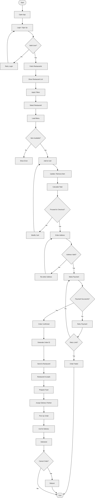

# 🚀 Software Engineering Systems

## 👩‍💻 Created by:

**Riya Korani**

---

## 📌 Project Overview

This repository contains system designs and documentation for real-world applications.
It includes structured flowcharts and Software Requirement Specification (SRS) based on Software Engineering principles.

---

## 📊 Systems Included

### 🚆 IRCTC Train Booking System

* User authentication
* Train search and selection
* Seat booking
* Payment processing
* Ticket generation

---

### 🛒 Online Shopping System

* User login/signup
* Product browsing and filtering
* Cart management
* Checkout and payment
* Order delivery

---

### 🍔 Food Delivery System

* Restaurant browsing
* Menu selection
* Cart and checkout
* Payment system
* Order tracking and delivery

---

## 📁 Contents

* Flowcharts (PNG format)
* SRS Document (Software Requirement Specification)

---

## 🛠 Tools Used

* Creately
* draw.io (diagrams.net)
* Mermaid

---

## 🎯 Purpose

This project demonstrates understanding of:

* System design
* Flowchart modeling
* Real-world application workflows
* Software Engineering documentation

---

## 📷 Diagrams Preview

### 🚆 IRCTC Train Booking System

### 🛒 Online Shopping System

### 🍔 Food Delivery System

## 🚀 Future Improvements

* Data Flow Diagrams (DFD)
* Use Case Diagrams
* Database Design (ER Diagram)
* System Architecture Design

---

## ⭐ Note

These systems are designed for learning and academic purposes, focusing on clarity, structure, and real-world logic.

---
